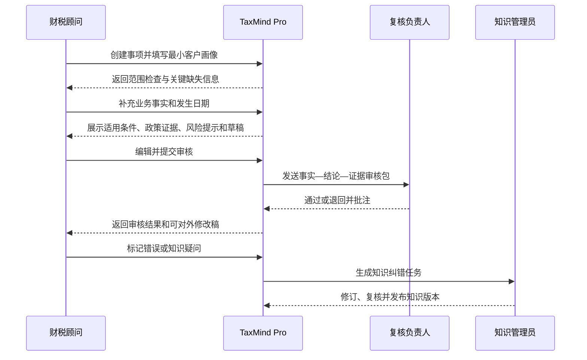

# TaxMind Pro 产品需求与功能规格说明书（MVP）

> 项目全称：TaxMind Pro——面向专业财税服务机构的税务知识图谱增强型智能咨询与风险审查平台  
> 文档版本：V0.1  
> 文档日期：2026-08-29  
> 文档性质：产品需求与功能边界，不包含技术架构、接口、数据库表和项目目录设计  
> 适用阶段：需求评审、MVP范围确认、后续架构设计输入

---

## 0. 结论先行

### 0.1 一句话定位

TaxMind Pro 是供税务师事务所、代理记账公司和财税咨询机构内部使用的专业辅助工作台：它围绕一个具体客户事项，组织必要事实，检索并核验有效政策，形成可追溯的适用性分析、风险提示、办税指引和待审核答复草稿。

### 0.2 本轮产品设计的核心判断

1. **第一版不是面向小微企业的税务聊天机器人。** 系统直接用户是财税专业人员，小微企业与个体工商户是其被服务客户。
2. **三个目标客户概念不能并列。** “个体工商户”是主体形态，“增值税小规模纳税人”是增值税身份，“小型微利企业”是企业所得税判定口径。系统必须按多维画像判断，不能用单一“客户类型”字段代替。
3. **MVP的风险能力应命名为“事项风险审查”，不能宣称“企业税务体检”或“全面税务审计”。** 第一版不接入真实账簿、申报表、发票明细和电子税务局数据，只能依据用户描述的事实和受控规则识别风险线索。
4. **政策时效不是普通筛选项，而是安全闸门。** 所有结论必须绑定“业务发生日期＋适用地区＋主体条件＋政策版本”。
5. **知识图谱不应单独成为一个炫技页面。** 它在产品层应体现为政策沿革、条款引用、条件链、跨税种关联和证据路径；普通用户不需要先理解节点和边。
6. **原来的“直接检索／子查询检索／回溯检索”不能作为业务路由。** 它们是可能的底层检索策略，不足以表达税务任务。产品首先要识别用户正在做政策查找、适用性判断、风险审查、办税事项查询还是版本核验。
7. **建议的MVP是可评测专业原型，而不是直接生产商用版。** 演示仅使用虚构或匿名化案例；若后续进入真实机构试点，必须另行完成客户授权、数据分类分级、部署方式、保留期限和安全评审。

### 0.3 决策状态

| 状态 | 含义 | 本文用法 |
|---|---|---|
| 已确定 | 用户已明确提出，产品设计必须遵守 | 目标用户、四类核心任务、官方公开数据优先、人工审核、第一版排除项 |
| 建议 | 本文基于可落地性做出的收缩或修正 | 全国政策＋广东/深圳地方层、限定行业、事项风险审查、角色权限、MVP页面范围 |
| 待确认 | 不阻塞本轮PRD，但会影响后续架构或排期 | 最终是作品集演示还是机构试点、部署形态、预计政策文件量、首批规则数量 |

---

## 1. 项目背景与问题定义

专业财税服务机构面对的核心问题并不是“找不到任何税务信息”，而是信息分散、政策时效变化快、适用条件复杂、地方口径不同，以及业务人员很难在有限时间内完成完整证据核对。

一个客户问题通常同时包含以下维度：

- 主体形态：公司、个人独资企业、合伙企业、个体工商户等；
- 税务身份：增值税一般纳税人或小规模纳税人；
- 企业所得税条件：是否满足小型微利企业相关条件；
- 行业和业务行为：销售货物、提供服务、出租、开票、取得补贴等；
- 业务发生日期：政策是否在当时有效；
- 注册地、经营地和事项办理地：地方政策与办税流程是否适用；
- 金额、频次、开票方式、交易对手等事实条件。

传统搜索可以返回文件，通用大模型可以快速生成文字，普通RAG可以召回相似条款，但它们都不能天然保证：

- 找到的是业务发生时有效的版本；
- 没有遗漏排除条件；
- 不把政策解读或热点问答误当成正式依据；
- 能展示新旧文件的修改、替代、废止和引用链；
- 每个关键结论都能回到原始条款；
- 信息不足时停止下结论并向顾问追问。

TaxMind Pro 的产品价值应建立在“缩短专业人员查证与初稿时间，同时让审核者更快发现证据缺口”上，而不是建立在“AI替代税务师”上。

---

## 2. 用户、客户与责任边界

### 2.1 直接使用者

| 用户角色 | 核心目标 | 主要痛点 | 系统权限建议 |
|---|---|---|---|
| 税务师／高级财税顾问 | 对复杂事项形成有依据的初步判断 | 跨文件查证慢，版本与例外条件易遗漏 | 创建事项、分析、编辑草稿、提交复核、查看全部证据 |
| 会计／代账顾问 | 快速回答高频客户问题并获取办理指引 | 经验差异大，搜索结果难组织成规范答复 | 创建事项、使用模板、查看证据、提交复核 |
| 复核负责人／质检人员 | 审核结论、依据、风险和措辞 | 传统聊天记录难追踪，无法快速定位结论出处 | 查看全量事项、批注、退回、通过、标记高风险 |
| 知识管理员 | 维护政策、规则、有效期和地方口径 | 政策更新分散，知识变更难同步 | 数据入库审核、关系审核、规则发布／停用、纠错处理 |
| 机构管理员 | 管理成员、权限与审计 | 缺少统一的责任记录 | 用户和角色管理、查看操作审计，不修改专业结论 |

### 2.2 被服务客户

被服务客户是财税机构接受委托后所服务的经营主体，不直接登录本系统。MVP重点覆盖：

- 在增值税维度属于小规模纳税人的企业；
- 需要判断是否满足小型微利企业条件的企业；
- 取得经营所得的个体工商户；
- 上述对象涉及的高频、常规、境内税务事项。

### 2.3 必须保持的区分

| 维度 | 系统使用者 | 被服务客户 |
|---|---|---|
| 身份 | 税务师、会计、财税顾问、审核人员 | 小微经营主体、个体工商户 |
| 输入 | 咨询问题、必要且最小化的客户事实 | MVP不直接操作系统 |
| 输出 | 内部分析与可修改草稿 | 经专业人员审核后才可能获得机构答复 |
| 决策责任 | 专业人员承担最终复核责任 | 根据正式服务关系采取行动 |
| 产品表述 | “辅助判断、待复核、证据不足” | 不出现“TaxMind已为客户作出正式税务意见” |

### 2.4 第一版排除用户

- 大型企业内部税务团队；
- 小微企业终端用户和普通个人纳税人；
- 税务机关内部人员；
- 无专业审核能力、希望系统直接作出最终决定的使用者。

---

## 3. 典型用户画像

### 3.1 代账顾问：李敏

- 同时维护数十户小规模纳税人和个体工商户；
- 高频处理开票、申报、优惠和经营所得问题；
- 熟悉常规流程，但遇到政策变更或特殊交易时需要请教主管；
- 期望系统先问清关键信息，再给出可复制但必须审核的答复草稿；
- 最怕引用过期政策或把某地口径套用到另一地区。

### 3.2 税务师：陈凯

- 处理比代账顾问更复杂的政策适用和风险判断；
- 不满足于“推荐几篇相似文章”，需要看到条款、文号、有效期、排除条件及沿革；
- 期望从一个经营行为出发，查看可能涉及的多个税种和后续义务；
- 对系统的要求是可验证、可追溯、允许保留“不确定”。

### 3.3 复核负责人：王经理

- 每天审核团队提交的客户答复；
- 重点检查事实是否完整、结论是否超出依据、风险提示是否充分；
- 期望系统把“客户事实—适用条件—证据条款—结论”排成审查清单；
- 需要保留修改记录和最终审核人，避免责任链断裂。

### 3.4 知识管理员：周老师

- 负责追踪新政策、失效废止文件、地方办税指南和内部标准；
- 需要区分正式法源、官方解读、操作指引和热点问答；
- 期望新知识在发布前经过自动校验和人工审核，发现影响旧答案的政策变化时能形成待处理任务。

---

## 4. MVP业务范围

### 4.1 建议的范围收缩

#### 地域范围

**建议：全国层面的有效政策＋广东省地方政策＋深圳市办税与地方口径。**

不建议第一版同时覆盖全国所有省市。原因不是技术上无法抓取，而是地方指南的栏目结构、更新频率、事项名称和发布方式不一致，全面覆盖会使数据审核量超过MVP收益。

#### 主体与税务身份范围

| 画像维度 | MVP纳入 | MVP排除或仅提示 |
|---|---|---|
| 主体形态 | 有限责任公司、个体工商户 | 合伙企业、个人独资企业、农民专业合作社、非营利组织等 |
| 增值税身份 | 小规模纳税人 | 一般纳税人的增值税计算与复杂抵扣事项 |
| 企业所得税 | 对企业进行小型微利企业条件判断及常见优惠查询 | 汇算清缴复杂调整、重组、研发加计扣除、高新技术企业等 |
| 个人所得税 | 个体工商户经营所得的常见事项 | 综合所得、股权激励、非居民和境外所得 |
| 行业 | 一般商贸、一般生活／商务服务 | 房地产、建筑、金融、进出口、平台经济、资源回收等特殊规则密集行业 |
| 数据形态 | 虚构、脱敏或匿名化的事实摘要 | 原始账簿、全量发票、申报表、银行流水、实名信息 |

#### 税务与事项范围

| 范围 | P0（MVP） | P1（MVP后） |
|---|---|---|
| 增值税 | 小规模纳税人常见应税交易、优惠条件、申报与开票关联 | 差额征税、跨地区预缴等复杂事项 |
| 企业所得税 | 小型微利企业资格条件、常见优惠、预缴／汇缴的基础指引 | 纳税调整、资产税务处理等复杂专题 |
| 经营所得个税 | 个体工商户常见经营所得政策、优惠与申报指引 | 合伙、个人独资及复杂成本扣除 |
| 发票 | 常见开具、红冲、作废、更正、保管与风险提示 | 全电发票系统操作模拟、异常凭证处理 |
| 纳税申报 | 查询办理条件、材料、渠道、期限和常见错误 | 自动填表、申报数据校验、电子税务局对接 |
| 优惠政策 | 小规模纳税人、小型微利企业、个体工商户的高频优惠 | 全行业、全生命周期优惠库 |
| 风险审查 | 基于事项事实的规则清单与证据提示 | 基于真实经营数据的持续监控和全面体检 |

### 4.2 建议的首批可验收场景包

为保证能形成高质量评测集，建议MVP只承诺以下场景包：

1. 小规模纳税人增值税优惠适用判断；
2. 小型微利企业所得税优惠条件判断；
3. 个体工商户经营所得优惠与申报指导；
4. 常见开票、红冲、作废、更正和保管问题；
5. 增值税、企业所得税、经营所得个税的常见申报事项；
6. 与以上事项直接相关的政策版本、有效期和废止关系查询；
7. 基于以上场景的事项级风险规则。

### 4.3 MVP的产品性质

由于当前明确不采集真实企业非公开涉税数据，本版本应被定义为：

> 面向专业机构的可演示、可评测、可扩展的专业辅助原型。

它可以验证工作流、证据链、适用性判断和规则审查能力，但不能仅凭本版本宣称已达到真实机构生产部署要求。

---

## 5. 核心业务痛点与产品目标

| 真实痛点 | 现有工作方式 | 造成的问题 | 对应产品能力 | 成功表现 |
|---|---|---|---|---|
| 政策分散 | 搜索引擎、官网、公众号、群聊收藏 | 查找时间长，来源层级混杂 | 统一政策检索与来源分级 | 能按文号、税种、地区、日期和状态定位原文 |
| 时效难核验 | 依赖个人经验查看发布日期 | 易引用已废止或被修改条款 | 版本沿革与业务日期校验 | 明确显示当时有效、当前有效及替代关系 |
| 适用条件复杂 | 人工逐条阅读并在脑中比对 | 容易漏掉排除条件和必要事实 | 条件矩阵与主动追问 | 每个条件显示满足／不满足／未知及其证据 |
| 咨询答复效率低 | 搜索后手工拼接答复 | 格式不统一，引用遗漏 | 结构化分析与答复草稿 | 草稿包含结论边界、政策依据和风险提示 |
| 风险判断依赖经验 | 资深人员口头传授 | 新人水平不稳定，难复盘 | 确定性风险规则＋证据说明 | 每条风险有触发事实、规则编号、依据和待核实项 |
| 审核成本高 | 在聊天记录或文档中逐句核对 | 证据和结论分离 | 审核工作台与结论—证据映射 | 审核者可一键定位每项关键结论的原始条款 |
| 地方流程不统一 | 临时查地方税局指南 | 材料、渠道和办理期限易混用 | 地区限定的办税事项卡 | 明确适用地区、更新时间和官方办理入口 |
| 知识更新不可控 | 人工群发通知 | 旧模板和旧答案继续被使用 | 变更影响清单与知识审核 | 政策变更能定位受影响规则、事项和草稿 |

### 5.1 产品目标

1. 将“找政策”升级为“围绕具体业务事实核验政策适用性”；
2. 降低专业人员初次检索、证据整理和草稿撰写时间；
3. 让审核者看见事实缺口、条件链和证据链，而不是只看流畅答案；
4. 对过期、错地区、错主体和证据不足的结论设置产品级阻断；
5. 建立可持续更新、可回滚、可审核的专业知识治理流程；
6. 在边界外问题和低证据场景中正确拒答或转人工，而不是强行回答。

### 5.2 不以此作为MVP目标

- 追求覆盖全部中国税法；
- 追求回答所有税务问题；
- 追求完全自动化或零人工审核；
- 追求像普通聊天机器人一样“每问必答”；
- 仅用回答流畅度作为产品质量标准。

---

## 6. 核心业务场景

| 场景编号 | 场景 | 用户输入 | 系统核心处理 | 输出 |
|---|---|---|---|---|
| UC-01 | 明确政策检索 | 文号、标题、政策关键词 | 精确定位并核验状态 | 原文、条款、文号、状态、沿革和相关文件 |
| UC-02 | 政策适用性判断 | 客户画像＋业务事实＋发生日期 | 条件匹配、排除检查、地域和时效校验 | 适用／不适用／信息不足／需人工判断 |
| UC-03 | 多条件客户咨询 | 自然语言问题和背景 | 提取事实、发现缺口、拆分子事项 | 分析、待补充信息、政策依据、答复草稿 |
| UC-04 | 事项风险审查 | 经营行为或拟采取方案 | 执行规则、关联义务与法规证据 | 风险清单、等级、触发原因、待核实项 |
| UC-05 | 办税流程查询 | 办税事项＋地区＋主体 | 核验事项适用范围和地方指南 | 条件、材料、渠道、流程、期限、依据 |
| UC-06 | 政策版本核验 | 文件、日期或历史业务 | 查找修改、替代、废止及当时状态 | 版本时间线和历史时点结论 |
| UC-07 | 跨税种影响分析 | 一项经营行为 | 关联可能税种、义务和申报事项 | 税种清单、义务链、需要核实的事实 |
| UC-08 | 内部审核 | 待审核分析或草稿 | 核对事实、规则、证据和措辞 | 通过、退回、批注、版本和审核记录 |
| UC-09 | 知识纠错 | 错误答案、过期政策或错误关系 | 定位证据和受影响对象 | 纠错单、处理状态、回归测试任务 |
| UC-10 | 超范围处置 | 复杂税种、特殊行业或证据缺失 | 识别范围边界 | 明确拒答原因、需补充材料或转资深人员建议 |

---

## 7. 核心工作流程



### 7.1 流程硬规则

- 没有业务发生日期时，不输出确定性的政策时效结论；
- 没有地区时，涉及地方政策或办税流程的查询必须追问；
- 没有关键主体条件时，不得把候选优惠写成“可以享受”；
- 关键结论没有条款级证据时，只能标为“待核实”，不能进入已审核状态；
- 顾问修改了关键事实后，原审核结论自动失效并需要重新提交；
- 知识版本发生变化时，历史结果保留原版本，不静默覆盖。

---

## 8. 产品功能模块总览

优先级定义：P0为MVP上线门槛，P1为完成P0后优先迭代，P2为后续增强。

| 模块 | 解决的用户痛点 | 核心能力 | 优先级 |
|---|---|---|---|
| 机构与角色管理 | 谁创建、谁审核、谁修改不可追踪 | 机构、成员、角色、权限 | P0 |
| 事项工作台 | 咨询事实散落在聊天和文档中 | 事项创建、画像、状态、历史记录 | P0 |
| 智能问询与范围闸门 | 问题背景不完整，系统容易猜测 | 意图识别、范围判断、关键事实追问 | P0 |
| 政策检索中心 | 官网与搜索结果分散 | 多条件检索、来源分级、状态过滤 | P0 |
| 政策证据与沿革 | 找到文件但不知道现行状态和条款关系 | 条款定位、版本时间线、引用和替代关系 | P0 |
| 适用性分析 | 条件、例外与事实难以系统比对 | 条件矩阵、排除检查、四态结论 | P0 |
| 咨询辅助与草稿 | 人工整理答复耗时且格式不统一 | 结构化分析、引用、风险提示、可编辑草稿 | P0 |
| 事项风险审查 | 风险判断过度依赖个人经验 | 规则执行、风险分级、证据和待核实项 | P0 |
| 办税事项指南 | 地方材料、渠道和流程易混用 | 地区化事项卡、材料清单、官方入口 | P0（限定事项） |
| 人工审核工作台 | 流畅答案掩盖证据缺口 | 逐结论审核、批注、退回、通过、版本对比 | P0 |
| 知识运营后台 | 新政策进入系统后缺少质量控制 | 来源管理、审核、发布、停用、影响分析 | P0（基础版） |
| 反馈与审计 | 错误无法闭环，责任不可追踪 | 错误反馈、操作日志、知识纠错闭环 | P0 |
| 机构知识模板 | 相同问题反复编写 | 审核后的答复模板和内部注释 | P1 |
| 质量与使用看板 | 不知道系统是否真正提升效率 | 命中率、退回率、错误类型、更新时效 | P1 |
| 批量客户风险扫描 | 单事项输入效率有限 | 基于结构化数据批量运行规则 | P2，需真实数据治理后 |

---

## 9. 详细功能需求

## 9.1 FR-01 机构、成员与角色管理

### 用户痛点

专业意见需要明确创建人、修改人和审核人。若所有成员拥有相同权限，知识发布、规则修改和结论审核将失去责任边界。

### 功能要求

| 功能点 | 要求 | 优先级 |
|---|---|---|
| 机构空间 | 每个机构拥有独立成员、事项、审核和知识运营空间 | P0 |
| 角色预设 | 顾问、复核负责人、知识管理员、机构管理员 | P0 |
| 权限控制 | 顾问不能发布政策知识；机构管理员不能以管理员身份替代专业审核 | P0 |
| 成员状态 | 启用、停用；停用后保留历史署名 | P0 |
| 最小权限 | 默认只开放完成本角色工作所需权限 | P0 |
| 细粒度自定义角色 | 机构自行组合权限 | P1 |

### 验收要点

- 每次创建、编辑、审核、发布、停用均能定位到用户和时间；
- 无审核权限的用户不能将事项标记为“审核通过”；
- 无知识管理权限的用户不能发布政策关系和风险规则。

## 9.2 FR-02 事项工作台与最小客户画像

### 用户痛点

自然语言问题常缺少决定政策适用性的关键事实。若系统直接回答，会把“不知道”误写成“满足条件”。

### 客户画像必须拆分的维度

| 维度 | 示例 | 产品规则 |
|---|---|---|
| 主体形态 | 有限责任公司、个体工商户 | 不得与纳税人身份混为一个字段 |
| 增值税身份 | 小规模纳税人、一般纳税人、未知 | 未知时不得判断小规模专属政策 |
| 企业所得税资格事实 | 行业、从业人数、资产总额、应纳税所得额等必要事实 | 系统不得仅凭“小微企业”口语标签认定小型微利企业 |
| 行业 | 商贸、生活服务、商务服务等 | 特殊行业命中排除范围时触发转人工 |
| 地区 | 注册地、经营地、事项办理地 | 按场景要求填写，不强制三个字段都相同 |
| 业务行为 | 销售、服务、开票、红冲、申报等 | 可一事项多行为，但需拆分分析 |
| 发生时间 | 业务发生日或所属期 | 是政策时效判断的必填项 |
| 金额与频次 | 销售额、交易次数等 | 仅在对应条件需要时收集 |
| 其他关键事实 | 交易对手、是否开具特定发票等 | 按问题动态追问，不做全量表单 |

### 功能要求

- 新建事项时使用客户代号，不要求录入真实名称、统一社会信用代码或个人身份信息；
- 支持从自然语言中提取候选事实，但必须让顾问确认后才能用于规则判断；
- 对每个事实标记来源：用户明确输入、系统提取待确认、顾问确认；
- 显示事项状态：草稿、待补充、分析中、待审核、已退回、已通过、已归档；
- 支持同一客户代号下建立多个事项，但MVP不建立真实客户主数据中心；
- 支持业务日期与查询日期并存，避免用“今天有效”替代“业务发生时有效”。

### 验收要点

- 将“深圳一家小微公司”输入系统时，系统必须继续询问主体、增值税身份以及与小型微利企业判断有关的必要事实；
- 未经用户确认的自动抽取事实不能静默触发“适用”结论；
- 关键事实改变后，风险结果、适用性结论和审核状态必须重新计算或失效。

## 9.3 FR-03 智能问询与范围闸门

### 用户痛点

专业咨询中最危险的不是不知道答案，而是不知道自己缺了什么信息。

### 功能要求

1. 识别用户任务类型；
2. 判断是否落在MVP税种、地区、主体和行业范围内；
3. 根据任务加载“最小必要事实清单”；
4. 一次只优先询问最能改变结论的关键信息，避免机械地展示长表单；
5. 对用户含糊表达给出候选解释，让用户选择而非系统自行假设；
6. 识别复合问题并拆分成可单独核验的子事项；
7. 对超范围事项给出边界说明、需要补充的专业材料或转资深人员建议。

### 追问优先级

| 等级 | 追问类型 | 示例 |
|---|---|---|
| 一级 | 会直接改变是否适用的事实 | 纳税人身份、业务发生日期、地区、主体形态 |
| 二级 | 会改变税额、办理方式或风险等级的事实 | 金额、频次、是否已开票、申报所属期 |
| 三级 | 只影响答复细节的事实 | 客户偏好的办理渠道、草稿语气 |

### 验收要点

- 对缺少一级事实的问题，系统不得输出确定结论；
- 对跨境、房地产等排除范围问题，系统明确说明超出MVP，不伪装成已覆盖；
- 复合问题必须展示拆分后的子事项，顾问可合并或删除。

## 9.4 FR-04 政策检索中心

### 用户痛点

用户既可能知道准确文号，也可能只描述业务现象。单一搜索框无法同时满足精确查文和场景查法。

### 功能要求

| 能力 | 要求 | 优先级 |
|---|---|---|
| 精确检索 | 支持标题、文号、发文机关和条款号 | P0 |
| 主题检索 | 支持自然语言、税种、业务行为、优惠事项 | P0 |
| 筛选 | 发文层级、来源类型、地区、状态、发布日期、适用日期 | P0 |
| 结果去重 | 同一文件的HTML、PDF、转载页不能被当成三份独立政策 | P0 |
| 权威来源优先 | 同内容存在多处转载时优先展示原发机关或政策法规库页面 | P0 |
| 历史版本 | 可选择“仅看业务日期有效”或“查看全部历史版本” | P0 |
| 结果解释 | 显示为什么命中：文号、标题、条款、适用对象或关联关系 | P0 |
| 保存到事项 | 将文件或条款加入当前事项证据集 | P0 |

### 结果卡必须显示

- 文件标题和文号；
- 发文机关；
- 法律层级／来源类型；
- 当前状态与业务日期状态；
- 适用地区；
- 成文、施行、失效或废止日期；
- 命中条款摘要；
- 官方来源链接；
- 是否存在修改、替代、废止或引用关系；
- 数据最后核验时间。

### 验收要点

- 使用准确文号能直接定位目标文件；
- 默认结果不把已废止文件混入“当前有效政策”；
- 历史事项查询可以找到当时有效、现在已废止的政策，并明确两种状态差异；
- 政策解读和热点问答必须有醒目的非正式法源标签。

## 9.5 FR-05 政策证据阅读与沿革

### 用户痛点

找到文件不等于确认依据。税务人员需要精确到条款，并看清文件之间的引用、修改、替代和废止关系。

### 功能要求

- 按“文件—章节—条款”阅读，并保留官方原文顺序；
- 点击答案引用可定位到具体条款，而不是只打开文档首页；
- 展示政策沿革时间线：发布、施行、修改、部分失效、全文失效、被替代；
- 展示关联文件：引用、被引用、修改、替代、废止、配套征管文件；
- 关系必须带来源条款或官方清理目录，禁止展示无证据的正式关系；
- 对“部分条款失效”显示受影响条款，不能把整份文件简单标记为失效；
- 支持将一条结论关联到一个或多个证据条款；
- 对证据文本显示来源URL、抓取时间、内容版本和审核状态。

### 验收要点

- 任一关键结论都能从结果跳转至原始条款；
- 任一修改／废止关系都能查看关系依据；
- 若关系只有机器抽取、尚未人工审核，前台不得将其作为正式确定事实使用。

## 9.6 FR-06 政策适用性分析

### 用户痛点

普通问答常把候选政策直接变成结论，忽略必要条件、排除条件、日期和地区。

### 输出结构

1. 待判断事项；
2. 已确认客户事实；
3. 候选政策及其效力层级；
4. 适用条件矩阵；
5. 排除条件矩阵；
6. 时效与地区检查；
7. 四态结论；
8. 不确定项与需补充材料；
9. 原文证据；
10. 人工复核提示。

### 四态结论

| 状态 | 使用条件 | 允许的产品措辞 |
|---|---|---|
| 初步适用 | 所有必要条件已确认满足，未命中排除项，证据有效 | “根据当前已确认事实，初步判断适用，仍需专业人员复核” |
| 初步不适用 | 至少一个必要条件明确不满足，或明确命中排除项 | “根据已确认的××事实，初步判断不适用” |
| 信息不足 | 关键条件未知 | “现有信息不足，暂不能判断；请补充……” |
| 需人工判断 | 政策冲突、地方口径不清、事实需要专业定性 | “存在以下不确定或冲突，建议由复核人员判断” |

### 条件矩阵

| 字段 | 说明 |
|---|---|
| 条件内容 | 从条款中提炼的可核验条件 |
| 条件类型 | 必要条件、排除条件、计算条件、程序条件 |
| 客户事实 | 已确认事实或“未知” |
| 匹配结果 | 满足、不满足、未知、不适用 |
| 判断方式 | 确定性规则、人工确认、文本推断待确认 |
| 证据 | 具体条款与官方链接 |
| 备注 | 冲突、例外或口径说明 |

### 验收要点

- 结论不得只显示一个不透明的“置信度百分比”；
- 条件不完整时必须进入“信息不足”，不能靠语言模型补全；
- 同时满足国家政策和深圳地方条件时，证据集中分别标识层级和地区；
- 对政策解读得出的说明性判断，必须同时寻找对应正式政策作为主要依据。

## 9.7 FR-07 客户咨询辅助与答复草稿

### 用户痛点

财税人员需要的是可复核、可修改、适合对客户表达的草稿，而不是一段无法核验的长答案。

### 标准输出结构

1. **问题理解**：系统如何理解客户问题；
2. **已知事实**：只列经顾问确认的信息；
3. **待补充问题**：按重要性排序；
4. **初步分析**：按子事项展开；
5. **适用／可能相关政策**：含文号和效力状态；
6. **原文依据**：条款级引用；
7. **风险与不确定性**：明确哪些内容不能下结论；
8. **办理建议**：仅提供官方渠道和可核验步骤；
9. **客户答复草稿**：专业人员可编辑；
10. **审核状态与免责声明**。

### 草稿规则

- 草稿默认标记“内部使用／待审核”；
- 不允许模型编造文号、条款号、办理入口和截止日期；
- 没有主要证据支撑的确定性句子自动标红或降级措辞；
- 顾问可以编辑，但系统保留机器初稿与人工修改的差异；
- 关键结论被人工改动后需重新确认引用；
- 复制或导出时保留版本号、生成日期和审核状态；
- P0支持复制和Markdown导出，Word/PDF正式模板列为P1。

### 验收要点

- 草稿中的每一项政策性关键主张均能定位到证据；
- 未审核草稿不能显示为“机构正式意见”；
- 删除风险提示或引用后，系统提示该修改可能影响审核。

## 9.8 FR-08 事项风险审查

### 用户痛点

新人可能知道一项优惠，但不知道还应检查发票、申报、资料留存和政策失效等风险。单靠大模型生成风险清单不可重复，也难以解释为什么触发。

### MVP定位

本模块只对当前事项和已确认事实执行受控风险规则，不读取真实企业全量财税数据。输出是“风险线索与核查建议”，不是违法认定、稽查结论或审计报告。

### 风险类别

| 类别 | 示例性检查方向 | MVP |
|---|---|---|
| 税种遗漏 | 经营行为是否可能同时触发其他税种或附加 | 纳入所选场景 |
| 纳税义务 | 是否存在申报、预缴或资料报送义务 | 纳入常见义务 |
| 发票风险 | 开票类型、时间、红冲／作废流程、保管要求 | 纳入高频规则 |
| 申报遗漏 | 事项发生后是否存在申报动作或期限 | 纳入办税事项范围内规则 |
| 优惠误用 | 主体、金额、行业、期间等条件是否缺失或不满足 | P0重点 |
| 政策失效 | 所引用政策是否在业务期已失效或被替代 | P0硬闸门 |
| 地域错配 | 是否错误使用异地政策或办税指南 | P0硬闸门 |
| 材料留存 | 政策或事项要求的证明、备查资料是否缺失 | 纳入精选事项 |
| 政策冲突 | 不同来源的效力、时点或口径是否冲突 | 识别并转人工 |
| 全量账税差异 | 账簿、发票、申报数据交叉核验 | MVP不做 |

### 每条风险结果必须包含

- 风险规则编号和版本；
- 风险名称及类别；
- 风险等级：高、中、低、提示；
- 触发事实；
- 未知但关键的事实；
- 确定性判断部分与解释性文字；
- 依据条款和来源；
- 建议核查动作；
- 是否需要复核人员强制确认；
- 规则最后审核时间。

### 风险等级规则

风险等级由受控规则确定，语言模型不得自由抬高或降低等级。模型可以把规则结果解释为自然语言，但不能改变触发状态。

### 验收要点

- 相同事实与相同规则版本应得到一致的触发结果；
- 每条高风险必须有正式政策证据和明确触发事实；
- 缺少事实时输出“待核实”，不得直接判定客户违规；
- 规则更新后，历史结果保留原规则版本并可选择重新评估。

## 9.9 FR-09 办税流程与材料指导

### 用户痛点

政策规定“应办理什么”与地方办税指南规定“具体怎么办”不是同一层信息，混用会导致材料、入口或期限错误。

### 每张办税事项卡必须包含

- 事项名称及标准化别名；
- 适用主体与办理前提；
- 适用地区；
- 办理材料及材料来源；
- 办理渠道：线上、线下或可选；
- 办理步骤；
- 法定／承诺办理时限（如官方提供）；
- 纳税人的申报或办理期限；
- 收费信息（如适用）；
- 设定依据；
- 官方操作指南链接；
- 常见错误和待核实提示；
- 最后核验时间。

### 产品规则

- “办理时限”和“纳税人应在何时申报”必须分开，禁止使用同一个“期限”字段表达；
- 地方指南不能跨地区复用；
- 找不到当前地区官方指南时，显示国家层一般要求，并明确提示用户核对主管税务机关口径；
- 产品只提供指导与跳转，不登录电子税务局，不代替用户提交。

### MVP首批事项建议

1. 增值税小规模纳税人申报；
2. 企业所得税预缴与年度申报的基础指引；
3. 个体工商户经营所得申报；
4. 发票开具与保管；
5. 红字发票／开票更正相关常见事项；
6. 申报错误更正；
7. 减免税相关基础办理；
8. 定期定额户常见申报事项。

最终数量建议控制在 **8—12个办税事项**，逐项做高质量数据和验收，不以目录数量作为成果。

## 9.10 FR-10 审核工作台

### 用户痛点

专业审核如果只看最终文字，仍需重新搜索政策，无法判断系统是否遗漏条件。

### 审核包内容

- 原始问题和经确认事实；
- 系统识别的子事项；
- 每个结论对应的条件矩阵；
- 关键结论—证据条款映射；
- 风险规则结果；
- 不确定项与冲突；
- 机器初稿、顾问修改稿和差异；
- 数据版本、规则版本和生成时间。

### 审核动作

| 动作 | 说明 |
|---|---|
| 通过 | 结论与草稿可标记为内部审核通过 |
| 有条件通过 | 指定条件补齐后可使用，仍保留限制 |
| 退回修改 | 指明事实、证据、规则或措辞问题 |
| 升级审核 | 转交更资深人员处理冲突或复杂事项 |
| 标记知识问题 | 创建与具体条款或关系绑定的纠错任务 |

### 验收要点

- 审核意见、审核人和时间不可被普通用户覆盖；
- 修改关键事实或关键结论后自动撤销原通过状态；
- 审核记录支持查看历史版本，不只保留最后结果。

## 9.11 FR-11 知识运营后台

### 用户痛点

如果政策数据自动进入系统后立即对外回答，错误抽取、过期转载或关系误判会直接污染结果。

### 功能要求

| 功能 | P0要求 |
|---|---|
| 来源白名单 | 配置允许采集的官方域名、栏目和内容类型 |
| 种子清单 | 人工登记首批文件、优先级和覆盖场景 |
| 采集记录 | 保存来源URL、采集时间、内容指纹和异常信息 |
| 元数据审核 | 文号、发文机关、日期、地区、状态、来源类型 |
| 条款审核 | 解析后的章节和条款需可与原文对照 |
| 关系审核 | 引用、修改、替代、废止关系必须有证据 |
| 规则审核 | 风险规则包含版本、适用范围、依据和测试用例 |
| 发布流程 | 待审核、已发布、已停用、需复查 |
| 变更影响 | 新版本影响哪些规则、事项卡和高频问题 |
| 回滚 | 错误知识版本可停用并恢复上一已审核版本 |

### 验收要点

- 未审核的重要关系和规则不能进入正式回答链路；
- 每次发布均记录审核人、发布时间和变更摘要；
- 政策状态变化时，系统能产生受影响知识对象清单。

## 9.12 FR-12 反馈、纠错与操作审计

### 功能要求

- 用户可针对答案、引用、条件、关系、风险规则或办税指南单独报错；
- 错误类型至少包含：政策过期、地区错误、主体不匹配、引用错误、结论过度、遗漏条件、流程过期、其他；
- 反馈必须绑定事项版本、知识版本和对应内容位置；
- 知识管理员可受理、复现、修复、驳回并填写原因；
- 修复后触发相关测试集回归；
- 操作审计记录登录、查询、创建、编辑、审核、导出、知识发布和权限变更；
- 普通业务用户只能查看与自己权限相关的审计信息。

---

## 10. 检索与任务路由的产品化重构

### 10.1 对原三类路由的评价

| 原路由 | 是否保留为业务路由 | 问题 | 正确位置 |
|---|---|---|---|
| 高置信短问→直接检索 | 否 | “短”不等于简单，短问也可能缺日期、地区和主体 | 可作为明确政策查询下的检索优化 |
| 政策对比→子查询检索 | 部分 | 多文件对比确实需拆解，但并非只有政策对比需要拆分 | 作为复合任务的执行策略 |
| 现象模糊→回溯检索 | 否 | “回溯”含义不清，无法形成产品验收标准 | 改为事实澄清＋业务行为→义务／政策关联检索 |

### 10.2 MVP业务路由

| 路由 | 必填或优先事实 | 主要输出 | 安全规则 |
|---|---|---|---|
| 明确政策查询 | 文号／标题／关键词 | 文件与条款 | 明示状态，不自动推断客户适用 |
| 政策适用性判断 | 主体、日期、地区、业务行为、特定条件 | 条件矩阵与四态结论 | 缺关键事实必须追问 |
| 多条件咨询 | 客户背景、问题描述 | 子事项、补充问题、分析和草稿 | 每个子事项单独核验证据 |
| 办税流程查询 | 事项、地区、主体、办理时间 | 地区化事项卡 | 无地方证据时明确降级 |
| 事项风险审查 | 经营行为和已确认事实 | 规则风险清单 | LLM不得成为唯一判断源 |
| 政策版本与有效期 | 文件或主题、业务日期 | 版本时间线和历史状态 | 区分当时有效与当前有效 |
| 超范围／证据不足 | 无法覆盖或无法可靠判断 | 拒答、转人工、补充材料 | 不生成貌似确定的答案 |

### 10.3 复合路由原则

用户的一次提问可以同时触发多个业务路由。例如“深圳小规模公司本季度收入达到某金额，怎么开票、是否能享受优惠、要不要申报”至少包含：

1. 政策适用性判断；
2. 发票事项；
3. 纳税申报事项；
4. 风险审查。

产品应先展示拆分结果，再分别生成证据和结论，最后在草稿层合并，不应把所有检索结果直接拼接给模型。

---

## 11. 证据、可信度与答案安全

### 11.1 来源层级

| 来源等级 | 内容类型 | 产品用途 | 能否单独支撑关键结论 |
|---|---|---|---|
| A | 法律、行政法规、部门规章、有效规范性文件、正式公告 | 主要法源 | 可以，但仍需适用条件核验 |
| B | 官方政策指引、官方政策解读 | 帮助理解、定位相关法源 | 原则上不单独作为最终依据 |
| C | 官方办税指南、公开操作手册 | 办理流程、材料和渠道 | 可支撑操作性结论，需限定地区和时间 |
| D | 官方热点问答、图解、视频 | 高频口径和解释性补充 | 不单独支撑重大结论 |
| E | 非官方文章、商业数据库、公众号转载 | MVP不进入正式知识 | 不可以 |

税务总局政策法规库本身已区分法律、行政法规、部门规章、财税文件、规范性文件、解读和政策指引，产品应保留这种效力与内容类型差异，而不是把所有“官方网页”视为同级资料。[国家税务总局政策法规库](https://fgk.chinatax.gov.cn/)

### 11.2 可信度不应只显示一个分数

产品需要显示可解释的质量维度：

| 维度 | 说明 | 示例状态 |
|---|---|---|
| 事实完整度 | 判断所需事实是否齐全 | 完整／缺少关键事实／仅有描述性事实 |
| 证据权威性 | 主要依据的来源层级 | A／B／C／D |
| 证据一致性 | 多来源之间是否冲突 | 一致／存在冲突／待核实 |
| 时效确定性 | 业务日期的有效状态是否明确 | 已确认／部分确认／不明 |
| 地域匹配度 | 证据是否适用于目标地区 | 匹配／仅国家层／错配 |
| 规则确定性 | 判断由确定性规则还是文本推断产生 | 规则确认／人工确认／推断待确认 |
| 审核状态 | 是否经过专业复核 | 未审核／退回／有条件通过／通过 |

可以在界面上汇总为高、中、低可信等级，但必须允许用户展开查看降级原因。禁止用“87%可信”掩盖缺日期或缺法源这类结构性问题。

### 11.3 必须阻断输出的情况

- 关键政策已经确认在业务期间失效，却仍被用作现行依据；
- 地方政策与客户地区不匹配；
- 候选优惠的必要主体条件明确不满足；
- 关键结论没有可定位来源；
- 来源之间存在实质冲突且未经过人工判断；
- 请求系统代替机构出具正式税务意见；
- 用户请求自动申报、缴税或登录电子税务局；
- 问题属于明确排除的复杂行业或国际税收领域。

---

## 12. 知识图谱在产品中的必要能力

本节只定义用户必须获得的能力，不规定Neo4j、索引或查询实现。

### 12.1 确有必要使用关联知识的场景

| 场景 | 仅相似文本检索的不足 | 产品应呈现的关联能力 |
|---|---|---|
| 政策沿革 | 旧文与新文可能文本并不相似 | 修改、替代、废止、部分失效时间线 |
| 条件核验 | 条件散落在多个条款或配套文件 | 优惠—条件—排除—主体—条款证据链 |
| 跨税种分析 | 一个经营行为可能对应多项义务 | 经营行为—税种—义务—申报事项链 |
| 风险解释 | 风险规则不能只是黑盒命中 | 风险规则—触发事实—法规条款—办理动作链 |
| 办税指导 | 事项、材料和政策依据分散 | 办税事项—条件—材料—流程—依据链 |
| 证据追溯 | 生成内容可能混合多个来源 | 结论—证据条款—政策文件—官方URL链 |

### 12.2 不需要强行使用知识图谱的场景

- 用户按准确文号查找文件；
- 对单条政策原文做关键词定位；
- 对审核后的固定问答模板进行调用；
- 普通全文浏览和下载；
- 与适用条件无关的界面导航。

### 12.3 MVP知识对象取舍

| 对象 | MVP决策 | 原因 |
|---|---|---|
| 政策文件 | 刚需 | 承载文号、状态、地区、日期和沿革 |
| 法规条款 | 刚需 | 条款级证据追溯的最小单位 |
| 税收优惠 | 刚需 | 适用性判断的主要业务对象 |
| 涉税义务 | 刚需 | 连接经营行为、税种和申报事项 |
| 经营行为 | 刚需但采用受控词表 | 是从客户事实进入知识链的入口 |
| 风险规则 | 刚需，作为受治理规则对象 | 需要版本、依据和测试用例 |
| 办税事项 | 刚需 | 承载流程、材料和地区差异 |
| 办理材料 | 刚需 | 办税指南核心输出 |
| 税种 | 刚需但可作为受控字典 | 数量有限，不必复杂化 |
| 发文机关 | 保留为规范字段／字典 | MVP无需建设庞大机构本体 |
| 地区 | 保留为标准行政区划维度 | 主要用于过滤和适用范围，不必把每个地区都复杂节点化 |
| 纳税人类型／企业类型 | 拆成主体形态、税务身份和资格条件 | 原候选概念混杂，直接使用会误判 |
| 适用条件／排除条件 | 作为可审核的结构化条件组 | 不建议把每个自然语言条件都建成孤立节点 |
| 客户类型／客户标签 | 不进入正式法规知识层 | 属于事项画像，不是法源知识 |
| 咨询事项 | 保留在业务事项层 | 不应污染公共政策知识图谱 |
| 行业完整本体 | 后续 | MVP仅用受控行业标签和排除清单 |
| 处罚规定 | 后续专题 | 复杂且高风险，MVP只在正式依据明确时提示 |
| 申报期限通用实体 | 暂不独立建模 | 先作为政策／事项的带时效规则，避免产生大量易过期节点 |

### 12.4 MVP必须支持的关系

| 关系 | MVP | 说明 |
|---|---|---|
| 文件包含条款 | 是 | 基础追溯 |
| 文件引用文件 | 是 | 衔接配套政策 |
| 文件修改／替代／废止文件 | 是 | 时效判断核心 |
| 条款涉及税种 | 是 | 跨税种关联 |
| 优惠依据条款 | 是 | 优惠结论追溯 |
| 优惠具有条件／排除组 | 是 | 适用性判断 |
| 条件适用于主体画像维度 | 是 | 客户事实匹配 |
| 经营行为触发涉税义务 | 是 | 风险与多税种分析 |
| 涉税义务对应办税事项 | 是 | 从判断到办理 |
| 风险规则依据条款 | 是 | 风险解释与治理 |
| 办税事项需要材料 | 是 | 办税指引 |
| 咨询事项引用政策文件 | 不作为公共知识关系 | 应记录为业务证据引用，不进入法规主图 |

---

## 13. 数据来源、采集与知识治理需求

### 13.1 已核验的官方来源基线

| 优先级 | 来源 | 产品用途 | 说明 |
|---|---|---|---|
| P0 | [国家税务总局政策法规库](https://fgk.chinatax.gov.cn/) | 正式政策、状态、关联文件、政策解读和指引入口 | 作为国家层政策主入口 |
| P0 | [国家税务总局官网](https://www.chinatax.gov.cn/) | 公告、纳税服务、热点问答和专题 | 与法规库互补，需区分内容类型 |
| P1 | [财政部税政司政策发布](https://szs.mof.gov.cn/zhengcefabu/index_1.htm) | 财政部及联合公告 | 联合政策的重要原发来源 |
| P1 | [税务总局政策指引栏目](https://fgk.chinatax.gov.cn/zcfgk/c100022/publist_zczy.html) | 官方优惠政策汇编和指引 | 用于种子清单和解释，不替代正式法源 |
| P2 | [广东省税务局政策法规库](https://guangdong.chinatax.gov.cn/siteapps/webpage/gdtax/fgk/ssfgk/policy_list.jsp) | 广东地方政策、状态和税种分类 | MVP地方政策层 |
| P2 | [广东省税务局办税指南入口](https://guangdong.chinatax.gov.cn/gdsw/sszyfw/common_list.shtml) | 办税指南、资料下载、事项清单 | 需逐事项验证更新时间 |
| P2 | [深圳市税务局](https://shenzhen.chinatax.gov.cn/) | 深圳政策、解读、热点问答和办税指南 | MVP地方办税层 |

官方政策指引可用于建立首批优惠政策种子。例如税务总局已发布《支持小微企业和个体工商户发展税费优惠政策指引（2.0）》，但该指引发布于2023年，进入知识库时仍需逐项核对后续文件和有效期，不能把汇编发布日期等同于持续有效。[官方指引页面](https://fgk.chinatax.gov.cn/zcfgk/c100022/c5218824/content.html)

### 13.2 为什么时效校验必须是P0

《中华人民共和国增值税法》自2026年1月1日起施行，意味着增值税知识在2026年前后存在明显制度切换。[国家税务总局法规库原文](https://fgk.chinatax.gov.cn/zcfgk/c100009/c5237365/content.html)

同时，税务总局在2026年仍发布失效废止文件清理公告。产品不能只记录“发布日期”，还必须记录生效、失效、部分失效和被替代关系。[国家税务总局公告2026年第18号](https://fgk.chinatax.gov.cn/zcfgk/c100012/c5251854/content.html)

### 13.3 采集方式

采用“人工种子清单＋白名单低频增量采集＋人工审核发布”。

#### 种子数据

- 由税务专业人员先列出MVP场景所需政策、配套文件、办税指南和高频问答；
- 每个场景先做“最小完备证据包”，再扩充相关文件；
- 优先收录原发机关页面，转载页仅作线索或备份；
- 首批不追求文件数量，而追求场景覆盖和关系完整。

#### 增量采集

- 只访问无需登录的公开页面；
- 仅在白名单栏目低频检查新增或更新；
- 遵守网站声明、robots规则、访问频率限制和技术边界；
- 遇到验证码、登录、签名接口或明确反自动化措施时停止，不绕过；
- 对PDF、附件和网页分别记录内容指纹，识别静默更新；
- 采集失败不使用非官方内容自动补位。

### 13.4 数据质量校验

| 校验层 | 校验内容 | 未通过处理 |
|---|---|---|
| 来源校验 | 域名、栏目、原发／转载、URL可访问性 | 不进入待发布区或标记来源异常 |
| 文件校验 | 标题、文号、机关、日期、地区、状态 | 进入人工复核 |
| 结构校验 | 章节、条款顺序、附件完整性 | 禁止发布条款级问答 |
| 时效校验 | 生效、失效、部分失效、替代关系 | 阻断正式使用 |
| 内容校验 | OCR错误、表格丢失、脚注和注释 | 回到原文修订 |
| 关系校验 | 引用、修改、替代、废止是否有明确依据 | 未审核关系只作候选 |
| 规则校验 | 条件表达、边界、反例、测试用例 | 不发布风险规则 |
| 场景校验 | 是否真的支撑MVP用户问题 | 不计入场景覆盖率 |

### 13.5 更新机制

1. 定期检查P0来源的新增文件和状态变化；
2. 对P1/P2来源按栏目设置不同检查频率；
3. 发现变化后创建“候选知识版本”，不直接覆盖生产版本；
4. 自动定位可能受影响的优惠、规则、办税事项和标准问答；
5. 知识管理员审核内容，税务专业人员审核业务影响；
6. 通过后发布新版本；
7. 对核心测试集执行回归；
8. 历史事项继续保留当时使用的知识版本。

### 13.6 数据合规与版权边界

公开可访问不等于可以不受限制地商业复制和重新分发。MVP应遵循以下原则：

- 对法律法规和正式政策以检索、结构化索引、必要引用和官方跳转为主；
- 保留来源、文号、机关、URL、采集时间和内容版本；
- 不提供官方资料整库下载或镜像站式服务；
- 对政策解读、图解、视频、图片、案例和操作手册按网站声明评估转载与商用边界；
- 优先保存用于检索与核验的必要文本，不对外复刻完整视觉作品；
- 对第三方转载内容追溯原发来源，找不到原发来源则不作为正式依据；
- 正式商用前由法务或合规人员复核目标网站条款和具体使用方式。

---

## 14. 页面与工作台规划

### 14.1 页面信息架构

| 页面 | 主要使用者 | 核心内容 | MVP |
|---|---|---|---|
| 登录与机构选择 | 全部用户 | 登录、机构空间、身份提示 | 是 |
| 我的工作台 | 顾问 | 待补充、待审核、被退回、最近事项 | 是 |
| 新建事项 | 顾问 | 问题输入、最小画像、范围提示 | 是 |
| 事项详情 | 顾问／审核人 | 事实、子事项、分析、风险、证据、草稿、审核 | 是，核心页 |
| 政策检索 | 顾问／知识管理员 | 搜索、筛选、结果、保存证据 | 是 |
| 政策详情 | 全部专业用户 | 原文条款、元数据、沿革、关联文件 | 是 |
| 办税事项库 | 顾问 | 地区化事项卡 | 是，限定8—12项 |
| 审核队列 | 复核负责人 | 待审事项、风险标记、退回原因 | 是 |
| 审核详情 | 复核负责人 | 事实—条件—证据—结论对照 | 是 |
| 知识运营 | 知识管理员 | 采集、审核、发布、停用、影响分析 | 是，基础版 |
| 风险规则库 | 知识管理员／审核人 | 规则范围、依据、版本、测试用例 | 是，基础版 |
| 反馈与纠错 | 全部专业用户 | 提交和追踪错误 | 是 |
| 审计日志 | 管理员／授权审核人 | 关键操作记录 | 是 |
| 质量看板 | 管理层／知识管理员 | 使用量、退回率、引用错误、更新时效 | P1 |

### 14.2 事项详情页布局建议

事项详情页是产品核心，不建议做成单一聊天窗口。建议采用“顶部状态＋左侧事实与子事项＋中部分析结果＋右侧证据与审核”的工作台布局。

#### 顶部

- 事项名称、客户代号、业务日期、地区；
- 当前状态、知识版本、规则版本、审核人；
- 超范围、证据冲突或政策失效警告。

#### 左侧

- 客户画像；
- 已确认事实与待确认事实；
- 子事项列表；
- 对话与补充记录。

#### 中部

- 条件矩阵；
- 适用性结论；
- 风险清单；
- 办税事项；
- 客户答复草稿。

#### 右侧

- 当前选中结论的条款证据；
- 政策状态和沿革；
- 引用完整度；
- 审核批注。

### 14.3 交互原则

- 证据随结论就近展示，避免用户在多个页面间反复跳转；
- 重要警告不能只用颜色表达，还要有文字和原因；
- “适用”按钮或标签必须带“初步”与“待审核”状态；
- 知识图谱默认以业务关系卡和时间线呈现，只有知识管理员需要查看完整关系图；
- 聊天是输入方式之一，不是整个产品的信息架构。

---

## 15. 非功能需求

### 15.1 准确性与可解释性

- 关键政策主张必须有条款级来源；
- 引用必须与结论语义相关，不能只因关键词相似；
- 任何“适用”结论必须展示条件矩阵；
- 风险命中必须显示规则和触发事实；
- 历史结果必须可复现到当时的知识与规则版本。

### 15.2 安全与隐私

- MVP只使用虚构、脱敏或匿名化客户画像；
- 输入界面提示用户不得上传实名信息、原始账簿、全量发票和申报数据；
- 按角色控制事项、审核、知识和审计权限；
- 重要操作记录不可由普通用户删除；
- 导出内容带机构内用、审核状态和生成时间标识；
- 日志中避免保存完整敏感问题文本，具体保留策略待架构阶段确定。

### 15.3 性能建议指标

以下为MVP体验目标，不是生产SLA：

| 操作 | 建议目标 |
|---|---|
| 精确政策检索 | 95%的请求在3秒内返回首屏结果 |
| 条款打开与证据定位 | 95%的请求在2秒内完成 |
| 复杂事项分析 | 5秒内给出处理状态，60秒内返回首版完整结果 |
| 审核页面打开 | 95%的请求在3秒内可操作 |
| 知识版本发布 | 发布过程可见状态，失败不影响上一稳定版本 |

### 15.4 可用性与可维护性

- 政策、规则、办税事项均需版本化；
- 解析或生成失败时显示可理解的错误，不输出半截结论；
- 核心流程支持保存草稿和恢复；
- 关键业务规则不应隐藏在提示词中，知识管理员应能查看其范围、依据和版本；
- 系统应支持后续扩展其他地区，但MVP不为“理论上的全国覆盖”牺牲当前数据质量。

### 15.5 责任声明

所有事项页和导出稿应包含清晰边界：

> 本结果基于当前已确认事实和系统所载政策资料生成，仅供财税专业人员内部分析与复核，不构成税务机关意见，不替代税务师或其他专业人员的最终判断，也不得未经审核直接作为机构对外正式税务意见。

---

## 16. MVP验收指标

### 16.1 功能验收

| 指标 | MVP门槛 |
|---|---|
| 首批场景包 | 第4.2节的7类场景全部可完整演示 |
| 办税事项 | 8—12个经过人工核验的广东／深圳高频事项 |
| 政策证据 | 所有P0场景的关键结论可定位到条款级官方来源 |
| 版本关系 | 选定测试文件的修改、替代、废止关系可完整展示 |
| 风险规则 | 每条规则有编号、版本、适用范围、证据、正反测试用例 |
| 审核闭环 | 创建、补充、提交、退回、修改、通过、归档全流程可追踪 |
| 纠错闭环 | 可从错误内容定位到知识对象并完成修订与回归 |

### 16.2 离线质量指标

需要由税务专业人员构建金标准测试集，不能用模型自评代替。

| 质量维度 | 建议指标 | 说明 |
|---|---|---|
| 文档检索召回率 | Recall@10 ≥ 90% | 金标准相关文件在前10条中的覆盖率 |
| 条款检索召回率 | Recall@10 ≥ 85% | 适用于条款级证据集 |
| 引用可验证率 | ≥ 98% | URL可访问、文号与原文一致、可定位条款 |
| 关键主张证据覆盖率 | ≥ 95% | 关键政策性主张具备有效证据 |
| 政策状态识别准确率 | ≥ 98% | 对测试集中的有效、失效、部分失效进行判断 |
| 地域过滤准确率 | ≥ 98% | 不把外地政策用于深圳事项 |
| 适用性判断准确率 | ≥ 90%，且错误“初步适用”单独统计 | 四态分类，不只看总体准确率 |
| 关键缺失信息识别率 | ≥ 90% | 缺日期、主体、地区等时能正确追问 |
| 高风险规则精确率 | ≥ 95% | 降低无依据的高风险提示 |
| 规则回归通过率 | 100% | 已发布规则的固定正反用例必须全部通过 |
| 超范围正确拒答率 | ≥ 95% | 明确排除领域不强答 |

### 16.3 安全质量指标

- 编造文号率：0；
- 无来源关键结论进入“审核通过”的数量：0；
- 已知失效政策被当作业务日期有效依据的严重错误：0；
- 未审核知识关系作为确定事实对外展示：0；
- 关键事实修改后仍沿用旧审核状态：0；
- 演示数据出现真实纳税人身份信息：0。

### 16.4 用户效果指标

建议在模拟试用中测量：

- 完成一个标准咨询事项的平均时间，相比纯人工基线下降30%以上；
- 审核者查找关键依据的平均时间下降40%以上；
- 首次提交被退回的主要原因可被分类并持续下降；
- 专业人员对“证据完整性”和“事实追问有效性”的评分均不低于4/5；
- 不以“生成字数”或“回答看起来像专家”作为成功指标。

---

## 17. MVP功能优先级与发布门槛

### 17.1 P0：缺失则不能称为TaxMind Pro MVP

1. 机构角色与责任记录；
2. 事项工作台与多维客户画像；
3. 范围识别和关键事实追问；
4. 官方政策检索与条款证据；
5. 政策版本、效力和地区校验；
6. 适用条件与排除条件矩阵；
7. 结构化咨询分析与可编辑草稿；
8. 受控风险规则及证据解释；
9. 限定事项的广东／深圳办税指南；
10. 人工审核、版本记录、错误反馈与操作审计；
11. 基础知识审核与发布流程；
12. 超范围拒答和责任声明。

### 17.2 P1：MVP验证后优先加入

- 机构审核模板和标准答复库；
- Word／PDF机构模板导出；
- 质量运营看板；
- 政策变更订阅与受影响事项提醒；
- 更细的团队权限和客户分组；
- 扩充广东其他城市办税事项；
- 更多常见行业场景；
- 审核通过案例的内部检索复用。

### 17.3 P2：需要真实机构试点和数据治理后再做

- 接入真实客户账簿、发票、申报表或财务系统；
- 批量风险扫描和持续税务监控；
- 电子税务局或其他业务系统集成；
- 自动填表、自动申报和自动缴税；
- 全国省市地方政策和办税指南覆盖；
- 大型企业税务团队、集团税务和复杂行业；
- 国际税收、转让定价、跨境重组；
- 对外客户门户和终端自助问答。

---

## 18. 明确不做的内容

### 18.1 业务不做

- 不代表财税机构对客户出具正式税务意见；
- 不作税收违法、偷逃税或处罚定性；
- 不承诺覆盖全部税法和所有地区；
- 不处理国际税收、转让定价、跨境重组等复杂领域；
- 不服务大型企业内部税务团队和普通个人；
- 不做完整企业税务审计或持续风险监控。

### 18.2 数据不做

- 不采集真实客户的非公开账簿、申报、发票和银行数据；
- 不采集电子税务局内部数据；
- 不采集个人身份信息或真实企业敏感信息；
- 不通过绕过登录、验证码、签名或反爬方式采集；
- 不建立官方原始资料整库下载服务。

### 18.3 产品不做

- 不自动登录电子税务局；
- 不自动纳税申报和缴税；
- 不把未审核生成内容标记为正式意见；
- 不把知识图谱节点数量当作产品成果；
- 不把一个综合置信度分数当作安全保证；
- 不为展示技术而增加与业务无关的复杂功能。

---

## 19. 主要产品风险与控制措施

| 风险 | 影响 | 产品控制 |
|---|---|---|
| 政策更新滞后 | 引用失效政策 | 白名单增量检查、状态闸门、人工发布、变更影响分析 |
| 文件关系抽取错误 | 错判政策沿革 | 重要关系必须有证据并人工审核 |
| 客户画像概念混淆 | 优惠适用判断错误 | 主体、税务身份、优惠资格事实分开建模 |
| LLM编造引用 | 严重专业风险 | 只允许引用已入库证据；文号和条款做一致性校验 |
| 检索到解读而漏正式文件 | 法源层级错误 | 来源分级，关键结论优先绑定A类来源 |
| 地方口径错配 | 办理材料或流程错误 | 地区硬过滤、地方证据缺失时降级提示 |
| 过度自信回答 | 用户误用 | 四态结论、缺失事实追问、强制人工审核 |
| 风险规则误报 | 降低信任、增加审核成本 | 规则版本化、正反用例、高风险精确率门槛 |
| 演示原型被误当生产系统 | 合规和责任风险 | 明确环境标签、禁用真实数据提示、导出水印 |
| 版权争议 | 商用和分发风险 | 必要引用＋官方跳转，不提供整库镜像，商用前专项复核 |

---

## 20. 后续架构设计的输入约束

下一阶段技术架构必须证明自己能满足以下产品约束，而不是从已有技术栈反推需求：

1. 同一政策的原文、条款、版本关系、检索片段和生成引用拥有统一标识；
2. 能同时支持精确文号检索、全文／语义检索、关系扩展和条件过滤；
3. 政策有效期、地区、主体和审核状态在进入生成前完成硬过滤；
4. 风险规则可独立执行、版本化和测试，不能藏在LLM提示词里；
5. 每项生成结论可以回溯到检索证据、规则版本和客户事实；
6. 未审核知识与已审核知识物理或逻辑隔离；
7. 历史事项可以复现，不因知识更新被静默改写；
8. 组件选择以MVP规模和可维护性为依据，允许删除不必要的中间件；
9. 不接入真实客户数据时，安全设计仍为后续试点预留清晰扩展点；
10. 评测链路能够复现每次检索、条件判断、引用和拒答结果。

---

## 21. 待确认事项

这些问题不阻塞本版PRD评审，但应在进入技术架构和项目排期前确认：

1. **交付目标**：MVP是个人作品集／面试项目，还是要找一家财税机构进行真实试点？两者对权限、安全、部署和数据量要求差异很大。
2. **首批地域**：是否确认只做全国政策＋广东省＋深圳市，暂不覆盖其他省市地方政策？
3. **首批业务包**：是否接受限定为一般商贸和一般服务业，并排除建筑、房地产、金融、进出口、平台经济等特殊行业？
4. **税务专家资源**：团队中是否有税务师可承担政策关系、适用条件、风险规则和评测集的最终审核？没有专业审核者，项目只能验证工程链路，不能验证税务正确性。
5. **首批规模**：后续需要确定种子政策文件、风险规则、办税事项和金标准问题的数量，以便设计合理架构和里程碑。

---

## 22. 本版评审清单

在进入架构设计前，建议按以下问题逐项确认：

- [ ] 是否认同系统直接用户仅为专业财税服务机构人员？
- [ ] 是否认同“主体形态、增值税身份、小型微利企业条件”分维度建模？
- [ ] 是否认同MVP风险能力限定为“事项风险审查”？
- [ ] 是否接受全国政策＋广东／深圳地方层的地域边界？
- [ ] 是否接受首批行业和场景收缩？
- [ ] 是否认同所有适用性结论使用四态，而不是简单“是／否”？
- [ ] 是否认同未审核内容不得作为正式机构意见？
- [ ] 是否认同政策时效、地区、主体和证据为P0硬闸门？
- [ ] 是否认同政策解读、热点问答不能与正式法源同级？
- [ ] 是否认同知识图谱重点服务沿革、条件链、义务链和证据追溯，而不是做关系可视化展示？
- [ ] 是否认同MVP只建设8—12个高质量办税事项，不追求目录数量？
- [ ] 是否认同下一阶段再决定FastAPI、Milvus、Neo4j、LangGraph、Redis等具体组件的保留与取舍？

---

## 附录A：建议的标准结果示意（非实际税务结论）

```text
事项：某深圳小规模纳税人咨询一项增值税优惠
业务日期：YYYY-MM-DD
地区：广东省深圳市

一、已确认事实
- 主体形态：有限责任公司
- 增值税身份：小规模纳税人
- 业务行为：……

二、尚缺事实
- 条件A：未知，可能改变优惠适用结论

三、适用性结论
- 状态：信息不足
- 原因：必要条件A尚未确认

四、候选政策与证据
- 文件名称／文号／状态
- 第X条原文
- 官方来源链接

五、风险提示
- 规则编号：R-XXX
- 状态：待核实
- 触发原因：……

六、办理建议
- 仅在补充条件并经专业人员复核后执行

七、审核状态
- 内部使用／待审核
```

## 附录B：官方信息核验说明

- 国家税务总局政策法规库支持按文件、解读和政策层级浏览，适合作为国家层政策主入口：[https://fgk.chinatax.gov.cn/](https://fgk.chinatax.gov.cn/)
- 《中华人民共和国增值税法》页面明确其自2026年1月1日起施行：[官方原文](https://fgk.chinatax.gov.cn/zcfgk/c100009/c5237365/content.html)
- 财政部税政司持续发布税收政策和联合公告：[政策发布栏目](https://szs.mof.gov.cn/zhengcefabu/index_1.htm)
- 广东省税务局提供政策法规库和办税指南入口：[政策法规库](https://guangdong.chinatax.gov.cn/siteapps/webpage/gdtax/fgk/ssfgk/policy_list.jsp)、[办税指南](https://guangdong.chinatax.gov.cn/gdsw/sszyfw/common_list.shtml)
- 深圳市税务局提供地方政策、政策解读、热点问答和纳税服务信息：[深圳市税务局](https://shenzhen.chinatax.gov.cn/)

